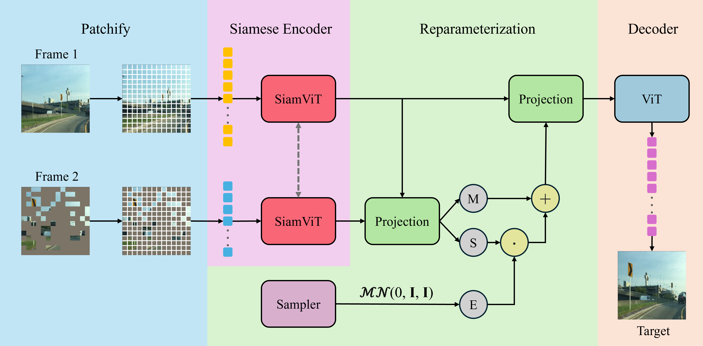

# SiamMCVAE: Reconstructing the Invisible in Video Frames



## Overview
In the evolving landscape of video frame restoration, accurately restoring missing information poses a considerable challenge, especially in critical applications like autonomous driving and surveillance. Our research introduces the Siamese Masked Conditional Variational Autoencoder (SiamMCVAE), a novel approach leveraging a siamese network architecture with dual encoders based on Vision Transformers (ViTs) to improve the model’s capability in understanding and reconstructing lost content by exploiting the intrinsic similarities between paired frames.

## Training
```bash
python main.py siammcvae_vit_base_patch16 --num_epochs 1000
